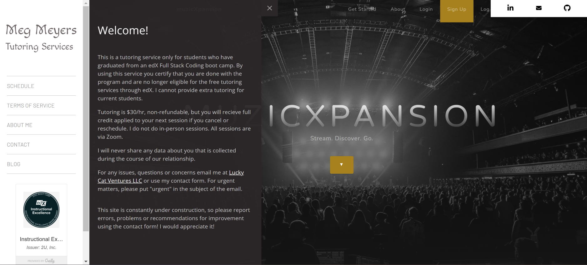
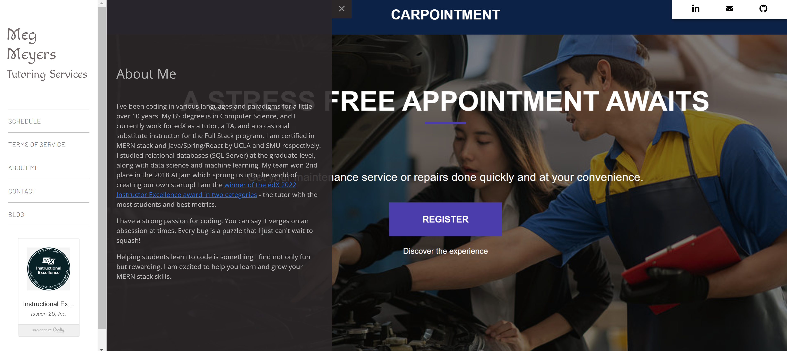
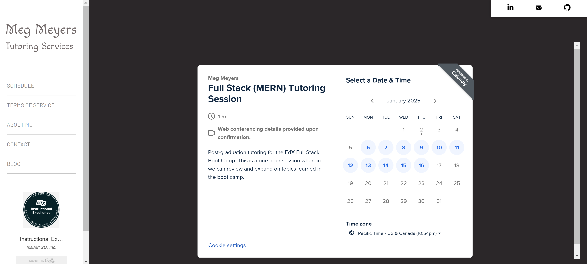
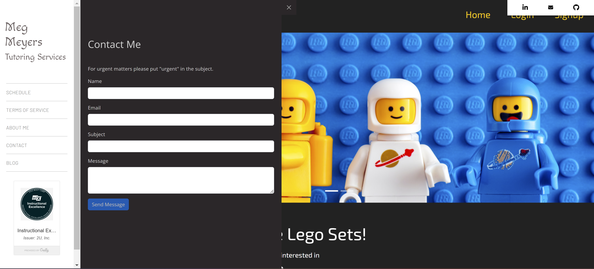
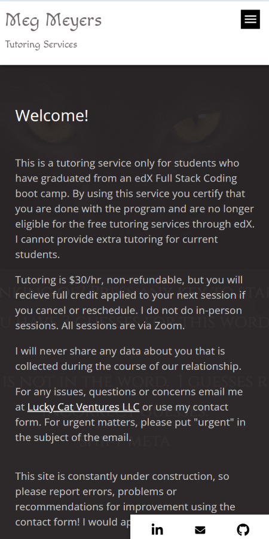
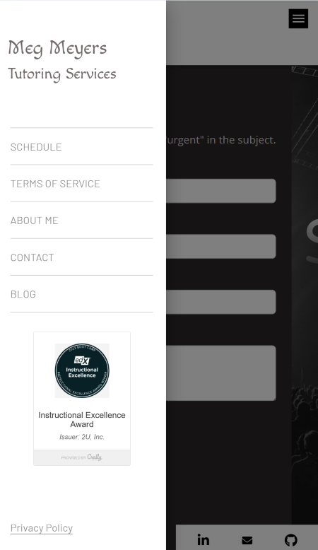

# Tutoring Business Application 
  

     
  
  ## Description  ✏️
  
  I wrote this website to advertise my tutoring business and give students an easy way to schedule with me using the integrated Calendly API. Built and styled with MUI. 
  
  ## Table of Contents 📖
  
  [Installation](#installation)

  [Usage](#usage)

  

  [Issues](#known-issues)


  [Credits](#credits)

  [Questions](#questions)
  
  ## Installation 
  
  To install necessary dependencies, run the following command:
  
  ```
  npm i
  ```
  
  ## Usage 
  
  Clone the repository, run the install command and then 'npm start'. Then navigate to the localhost port.

  ### Deployed Link
  [https://heartfelt-kulfi-3d2f28.netlify.app/]("https://heartfelt-kulfi-3d2f28.netlify.app/)

### Screenshots









______________________________________________________________________________________


## Known Issues 
None


## Credits 
[Calendly API](https://developer.calendly.com/api-docs) <br>
Inspiration for the design on the website thanks to https://www.arbor-restaurant.co.uk/

 ## Questions 
  
 If you have any questions about the repo or notice any bugs you want to report, open an issue or contact me directly at megan.meyers.388@gmail.com. 
  
  